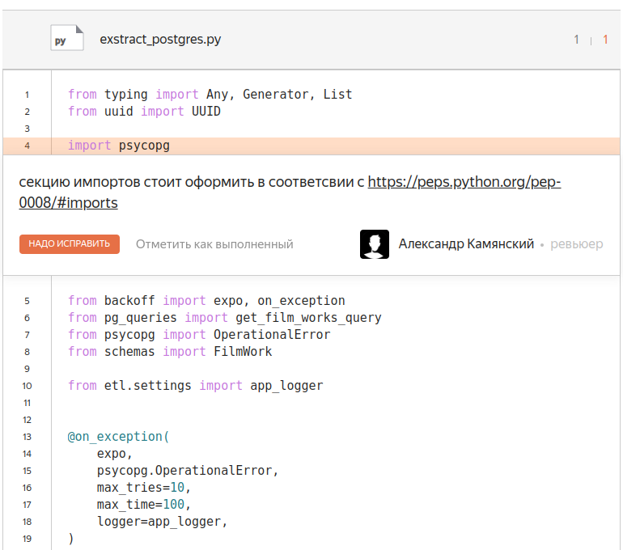

# Импорты
## Если честно не могу понять, что у меня не так с импортами, советовался с ребятами, они тоже не поняли что не так ((

## Импорты у меня вроде бы отсортированы. Для этого использую библиотеку isort
## Буду благодарен, если подробнее опишите как мне лучше оформить импорты )

